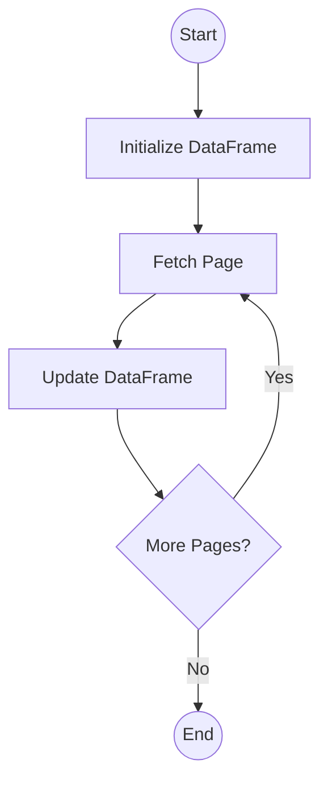

# Python State Flow

This is a lightweight workflow orchestrator. You define a State object that is passed from task
to task, where you save any changes you make. At the end of the workflow, the State object is passed back to
you with the relevant results.

The library is based on LangGraphs StateGraph. There are a number of differences. Tasks or Nodes in my case are
classes and not functions. I have also enforced the use of Pydantic to create the State object.

This library allows you to define workflows similar to a DAG, except it allows for circular flows. Use this to split
your complex workflows into Nodes or tasks so they are straightforward to maintain and update 


## Features

- **Pydantic Integration**: Use Pydantic models for type-safe state management.
- **Synchronous & Asynchronous Support**: Define both sync and async nodes and flows.
- **Graph-Based Routing**: Easily define edges and conditional routing between nodes.
- **Type Safety**: Full type hint support for state objects.

## Installation

This project uses `uv` for dependency management.

```bash
uv add state-flow
```

Or with pip:

```bash
pip install state-flow
```

### Setup

```bash
uv sync
```

Alternatively, you can install the project in editable mode using pip:

```bash
pip install -e .
```

## Core Concepts

### 1. State

The State object is a predefined Pydantic `BaseModel`, which behaves similarly to a Python dataclass. It serves as the central data structure that is passed between nodes in your workflow, accumulating data and changes as the process executes.

We chose Pydantic for this role to leverage its robust validation and data transformation capabilities. By using Pydantic, you can define functions that automatically validate or transform fields as they are updated. This ensures that your state remains consistent and correct throughout the workflow execution.

For example, if a field is expected to be a Python `date` object but receives a string representation (e.g., from an API response or user input), you can use Pydantic's `BeforeValidator` to automatically parse that string into a proper date object before it is assigned to the state. This removes the need for manual parsing logic inside your nodes and keeps your business logic clean.

#### Example: Complex State with Validation

Here is an example of a more complex state object that demonstrates required fields, automatic type conversion using `BeforeValidator`, and fields for error handling and logging.

```python
from datetime import datetime
from typing import Annotated, List, Optional
from pydantic import BaseModel, Field, BeforeValidator

def parse_datetime(v: str | datetime) -> datetime:
    if isinstance(v, str):
        return datetime.fromisoformat(v)
    return v

class WorkflowState(BaseModel):
    # Required fields that must be supplied when creating the state
    user_id: str
    request_id: str

    # Fields with automatic conversion using BeforeValidator
    # This will convert string inputs like "2023-10-27T10:00:00" into datetime objects
    created_at: Annotated[datetime, BeforeValidator(parse_datetime)]
    updated_at: Annotated[datetime, BeforeValidator(parse_datetime)] = Field(default_factory=datetime.now)

    # Fields for tracking execution history and errors
    logs: List[str] = Field(default_factory=list)
    errors: List[str] = Field(default_factory=list)
    
    # Optional data that might be populated during the workflow
    processed_data: Optional[dict] = None

    def log(self, message: str):
        """Helper method to add log entries with timestamps"""
        self.logs.append(f"{datetime.now().isoformat()}: {message}")

    def add_error(self, error_msg: str):
        """Helper method to record errors"""
        self.errors.append(error_msg)

# Usage
# Even though we pass strings for dates, Pydantic converts them to datetime objects
state = WorkflowState(
    user_id="user_123",
    request_id="req_abc",
    created_at="2023-10-27T10:00:00"
)

print(type(state.created_at))  # <class 'datetime.datetime'>
state.log("Workflow started")
```

### 2. Nodes

Nodes represent a single step in your workflow. Unlike some other libraries where nodes can be simple functions, in State Flow, a Node is a class.

```python
from state_flow import Node, START, END

class MyNode(Node):
    def exec(self, state: MyState):
        state.value += 1
        # Optional: set self.result for conditional routing
        self.result = "success"
```

To create a node, you must inherit from `Node` (for synchronous workflows) or `AsyncNode` (for asynchronous workflows) and override the `exec` method.

The `exec` method does not receive arguments. Instead, you access the current state via `self.state`. Inside this method, you can modify the state object directly.

After execution, the node returns the modified state object along with a `result` string. You don't need to return these manually; the base class handles it. However, you can set the `self.result` attribute within your `exec` method. This `result` string is crucial for **conditional edges**, as it determines which node will be executed next in the workflow.

```python
class MyNode(Node[MyState]):
    def exec(self) -> None:
        # Modify the state
        self.state.some_field = "new value"
        
        # Set the result for conditional routing
        if self.state.some_value > 10:
            self.result = "high"
        else:
            self.result = "low"
```

### 3. Flows

Flows define the structure and execution logic of your workflow graph. To create a flow, you inherit from `StateFlow` (for synchronous workflows) or `AsyncStateFlow` (for asynchronous workflows).

The most critical part of defining a flow is overriding the `setup_graph` method (or `_setup_graph` for async flows). This is where you register your nodes and define the connections (edges) between them.

#### `add_node(name: str, node: Node)`
Registers a node in the graph.
- `name`: A unique string identifier for the node.
- `node`: An instance of your node class.

```python
self.add_node("process_data", ProcessDataNode())
```

#### `add_edge(from_node: str, to_node: str)`
Creates a direct connection between two nodes. When `from_node` finishes execution, `to_node` is executed next.
- `from_node`: The name of the source node.
- `to_node`: The name of the destination node.

```python
self.add_edge("step_1", "step_2")
```

#### `add_conditional_edges(from_node: str, path_map: dict[str, str])`
Creates dynamic routing based on the result of the `from_node`.
- `from_node`: The name of the source node.
- `path_map`: A dictionary mapping the `result` string (set in the node's `exec` method) to the name of the next node.

```python
# If "decision_node" sets self.result = "success", go to "success_handler"
# If "decision_node" sets self.result = "failure", go to "error_handler"
self.add_conditional_edges("decision_node", {
    "success": "success_handler",
    "failure": "error_handler"
})
```

#### `START` and `END`
These are special constants used to define the entry and exit points of your graph.
- `START`: Represents the beginning of the flow. You must add an edge from `START` to your first node.
- `END`: Represents the completion of the flow. Edges pointing to `END` signify that the workflow should terminate.

```python
from src.nodes import START, END

self.add_edge(START, "first_node")
self.add_edge("last_node", END)
```

## Usage

### Synchronous Flow Example

```python
from typing import List
from pydantic import BaseModel, Field
from src.nodes import Node, START, END
from src.flows import StateFlow

# 1. Define your state
class MyState(BaseModel):
    history: List[str] = Field(default_factory=list)

# 2. Define your nodes
class NodeA(Node[MyState]):
    def exec(self) -> None:
        self.state.history.append("A")
        # You can set self.result to control conditional routing
        self.result = "next"

class NodeB(Node[MyState]):
    def exec(self) -> None:
        self.state.history.append("B")

# 3. Define your flow
class SimpleFlow(StateFlow[MyState]):
    def setup_graph(self) -> None:
        self.add_node("A", NodeA())
        self.add_node("B", NodeB())
        
        self.add_edge(START, "A")
        self.add_edge("A", "B")
        self.add_edge("B", END)

# 4. Run the flow
flow = SimpleFlow()
final_state = flow.run(MyState())
print(final_state.history)  # Output: ['A', 'B']
```

### Asynchronous Flow Example

```python
import asyncio
from src.nodes import AsyncNode, START, END
from src.flows import AsyncStateFlow

class AsyncWorker(AsyncNode[MyState]):
    async def exec(self) -> None:
        await asyncio.sleep(0.1)
        self.state.history.append("AsyncWork")

class AsyncFlow(AsyncStateFlow[MyState]):
    def setup_graph(self) -> None:
        self.add_node("worker", AsyncWorker())
        self.add_edge(START, "worker")
        self.add_edge("worker", END)

async def main():
    flow = AsyncFlow()
    final_state = await flow.run(MyState())
    print(final_state.history)

if __name__ == "__main__":
    asyncio.run(main())
```

### Conditional Edges

You can route to different nodes based on the `result` attribute set within a node.

```python
class DecisionNode(Node[MyState]):
    def exec(self) -> None:
        if len(self.state.history) > 5:
            self.result = "long"
        else:
            self.result = "short"

class MyFlow(StateFlow[MyState]):
    def setup_graph(self) -> None:
        self.add_node("decision", DecisionNode())
        self.add_node("process_long", LongNode())
        self.add_node("process_short", ShortNode())
        
        self.add_edge(START, "decision")
        self.add_conditional_edges("decision", {
            "long": "process_long",
            "short": "process_short"
        })
        self.add_edge("process_long", END)
        self.add_edge("process_short", END)
```

## Complex Example: API Pagination to DataFrame

This example demonstrates a workflow that fetches data from a paginated API, accumulates the results, and finally converts them into a Pandas DataFrame.

### Workflow Diagram



### Code

```python
import pandas as pd
from typing import List, Any, Optional
from pydantic import BaseModel, Field, ConfigDict
from src.nodes import Node, START, END
from src.flows import StateFlow

# 1. Define State
class ApiState(BaseModel):
    # Allow arbitrary types for pandas DataFrame
    model_config = ConfigDict(arbitrary_types_allowed=True)
    
    current_page: int = 1
    total_pages: int = 1
    current_data: List[dict] = Field(default_factory=list)
    final_dataframe: Optional[pd.DataFrame] = None
    base_url: str

# 2. Define Nodes

class InitDataFrameNode(Node[ApiState]):
    def exec(self) -> None:
        print("Initializing empty DataFrame...")
        self.state.final_dataframe = pd.DataFrame()

class FetchPageNode(Node[ApiState]):
    def exec(self) -> None:
        # Simulate API call
        print(f"Fetching page {self.state.current_page}...")
        
        # Mock response data
        mock_response = {
            "data": [{"id": i, "value": f"val_{i}"} for i in range(self.state.current_page * 10, (self.state.current_page + 1) * 10)],
            "total_pages": 3
        }
        
        # Store current page data
        self.state.current_data = mock_response["data"]
        self.state.total_pages = mock_response["total_pages"]

class UpdateDataFrameNode(Node[ApiState]):
    def exec(self) -> None:
        print("Updating DataFrame with new data...")
        new_df = pd.DataFrame(self.state.current_data)
        if self.state.final_dataframe is None:
             self.state.final_dataframe = new_df
        else:
             self.state.final_dataframe = pd.concat([self.state.final_dataframe, new_df], ignore_index=True)
        
        # Determine next step
        if self.state.current_page < self.state.total_pages:
            self.state.current_page += 1
            self.result = "next_page"
        else:
            self.result = "done"

# 3. Define Flow

class ApiPaginationFlow(StateFlow[ApiState]):
    def setup_graph(self) -> None:
        self.add_node("init_df", InitDataFrameNode())
        self.add_node("fetch_page", FetchPageNode())
        self.add_node("update_df", UpdateDataFrameNode())
        
        # Start by initializing DataFrame
        self.add_edge(START, "init_df")
        self.add_edge("init_df", "fetch_page")
        self.add_edge("fetch_page", "update_df")
        
        # Loop back to fetch_page if there are more pages, otherwise end
        self.add_conditional_edges("update_df", {
            "next_page": "fetch_page",
            "done": END
        })

# 4. Run
if __name__ == "__main__":
    initial_state = ApiState(base_url="https://api.example.com/items")
    flow = ApiPaginationFlow()
    result_state = flow.run(initial_state)
    
    print("\nFinal DataFrame:")
    print(result_state.final_dataframe.head())
    print(f"Total rows: {len(result_state.final_dataframe)}")
```