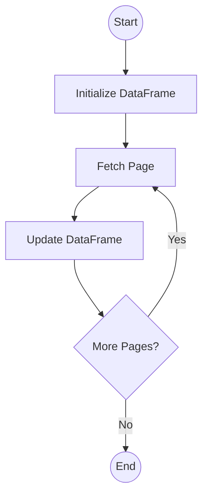

# Mastering Workflow Orchestration with Python Simple State Flow

## Introduction

Modern software development often involves complex sequences of tasks—fetching data, processing it, making decisions, and saving results. Doing this with simple function calls often leads to "spaghetti code" where state is passed around haphazardly, making debugging and maintenance a nightmare.

You've likely faced these problems:
*   **State Management:** It's hard to track how data changes as it moves through a pipeline.
*   **Conditional Logic:** `if/else` blocks nested deep within functions obscure the high-level flow.
*   **Type Safety:** Passing dictionaries or loose objects leads to runtime errors that could have been caught earlier.

While tools like **LangGraph** and **PocketFlow** exist to solve these problems, they often come with their own trade-offs. LangGraph's StateGraph is powerful but brings significant vendor lock-in and a heavy dependency ecosystem that can be overkill for many projects. PocketFlow, on the other hand, offers a solution that can feel un-Pythonic, with a node creation process that is often overly complicated and verbose.

Enter **`simple-state-flow`**. It's a lightweight, Pythonic library designed to orchestrate workflows with elegance and precision. Inspired by the best parts of these tools but built for developers who prefer **class-based architecture** and **strong typing**, `simple-state-flow` enforces structure without sacrificing flexibility or imposing heavy dependencies.

It is worth noting that while `simple-state-flow` is an excellent choice for building **AI Agent workflows**—providing the structured state management and routing that agents require—it is completely agnostic to the underlying LLM infrastructure. This means it has no direct tie-ins to OpenAI, Anthropic, or any specific model provider. Consequently, it is equally powerful for general-purpose projects, such as data processing pipelines, ETL jobs, or complex business logic automation, where no AI components are involved at all.

Key benefits include:
*   **Type-Safe State:** Powered by Pydantic, ensuring your data is always valid.
*   **Visualizable Logic:** The graph structure can be exported to Mermaid diagrams.
*   **Sync & Async:** Native support for both synchronous and asynchronous workflows.
*   **Clean Routing:** Logic for "what happens next" is decoupled from the business logic of "what happens now."

## The Core Philosophy: State as the Source of Truth

In `simple-state-flow`, the **State** is king. It is a single object that travels through every node in your workflow. Nodes read from it, modify it, and pass it on. This eliminates side effects and makes the data flow transparent.

We chose the **Pydantic `BaseModel`** as the foundation for the State object. This isn't just for type hints; it's for **runtime validation and transformation**.

Imagine you receive a date as a string from an API. With Pydantic's `BeforeValidator`, you can automatically convert it to a Python `datetime` object *before* your business logic ever sees it.

```python
from datetime import datetime
from typing import Annotated, List
from pydantic import BaseModel, Field, BeforeValidator

def parse_datetime(v: str | datetime) -> datetime:
    if isinstance(v, str):
        return datetime.fromisoformat(v)
    return v

class WorkflowState(BaseModel):
    # Required fields
    user_id: str
    
    # Auto-converting field
    created_at: Annotated[datetime, BeforeValidator(parse_datetime)]
    
    # State history
    logs: List[str] = Field(default_factory=list)
```

## Building Blocks: Nodes as Classes

While functional programming is great, complex workflows often benefit from the encapsulation of classes. In `simple-state-flow`, every step is a **Node**.

A Node class:
1.  Inherits from `Node[T]` (or `AsyncNode[T]`).
2.  Implements the `exec(self)` method.
3.  Accesses the state via `self.state`.
4.  Controls the next step via `self.result`.

The `exec` method is where the work happens. You don't return the state; you modify `self.state` in place. You don't return the next node's name; you set `self.result` (which defaults to "done").

```python
from nodes import Node

class ValidateUserNode(Node[WorkflowState]):
    def exec(self) -> None:
        # Access and modify state
        if not self.state.user_id:
            self.state.logs.append("Error: Missing user ID")
            self.result = "error"  # Route to error handler
        else:
            self.state.logs.append(f"Validating user {self.state.user_id}")
            self.result = "success" # Route to next step
```

## Orchestrating the Flow: The Graph

The **Flow** is the map. It defines the nodes (cities) and the edges (roads) connecting them. You create a flow by subclassing `StateFlow` and overriding `setup_graph`.

Key methods include:
*   `add_node("name", NodeInstance())`: Places a node on the map.
*   `add_edge("start", "end")`: Draws a direct road.
*   `add_conditional_edges("start", {"result": "destination"})`: Draws a fork in the road based on the node's `result`.
*   `START` and `END`: The entry and exit gates.

**Dynamic Workflows:**
It's important to note that these graph-building methods (`add_node`, `add_edge`, etc.) are not restricted to the `setup_graph` method. They can be called on the Flow object even after it has been initialized. This allows for **dynamic workflow creation**, where you can programmatically construct or modify your graph based on runtime conditions or configuration files before execution.

```python
from flows import StateFlow
from nodes import START, END

class UserOnboardingFlow(StateFlow[WorkflowState]):
    def setup_graph(self) -> None:
        self.add_node("validate", ValidateUserNode())
        self.add_node("welcome", SendWelcomeEmailNode())
        self.add_node("error", ErrorHandlerNode())
        
        self.add_edge(START, "validate")
        
        # Conditional routing
        self.add_conditional_edges("validate", {
            "success": "welcome",
            "error": "error"
        })
        
        self.add_edge("welcome", END)
        self.add_edge("error", END)
```

## Real-World Example: Paginated API Data Extraction

A common task is fetching all pages of data from an API and combining them. This requires a loop, state accumulation, and a termination condition.

Here is how you would structure that workflow:

1.  **InitDataFrameNode**: Sets up an empty container.
2.  **FetchPageNode**: Calls the API for `current_page`.
3.  **UpdateDataFrameNode**: Adds data to the DataFrame and checks `current_page < total_pages`.

The `UpdateDataFrameNode` sets `self.result = "next_page"` to loop back to `FetchPageNode`, or `"done"` to finish.



## Advanced Features & Best Practices

### Async Support
For I/O-heavy tasks (like the API example above), use `AsyncStateFlow` and `AsyncNode`. The structure is identical, but `exec` is an `async def`.

### Error Handling
Don't let your workflow crash. Use a `try/except` block within your `exec` method. Capture the error, add it to an `errors` list in your State, and set `self.result = "failure"` to route to a cleanup or notification node.

### Testing
Since Nodes are just classes, you can instantiate them, pass a mock State, run `exec()`, and assert the changes to `self.state` and `self.result`. No need to run the whole flow to test one step.

## Conclusion

`simple-state-flow` brings structure to chaos. By combining the strict validation of Pydantic with a clear, graph-based execution model, it allows you to build workflows that are robust, readable, and easy to debug. Whether you're building a simple data script or a complex microservice orchestrator, `simple-state-flow` provides the solid foundation you need.
