# StateFlow Examples

This directory contains a collection of 25 real-world examples demonstrating how to use `simple-state-flow` to build complex, conditional workflows. Each example highlights different aspects of the library, specifically focusing on **conditional edges** for branching logic.

---

## Index

### Financial & Transactional
1.  [Payment Processing Gateway](#1-payment-processing-gateway)
2.  [Subscription Billing Logic](#2-subscription-billing-logic)
3.  [Refund Approval Workflow](#3-refund-approval-workflow)
4.  [Fraud Detection Pipeline](#4-fraud-detection-pipeline)
5.  [Expense Reimbursement](#5-expense-reimbursement)

### User Lifecycle & Security
6.  [Multi-Factor Authentication (MFA)](#6-multi-factor-authentication-mfa)
7.  [Identity Verification (KYC)](#7-identity-verification-kyc)
8.  [User Onboarding](#8-user-onboarding)
9.  [Password Reset Flow](#9-password-reset-flow)
10. [Account Suspension Recovery](#10-account-suspension-recovery)

### Data & ETL Pipelines
11. [File Import & Validation](#11-file-import-and-validation)
12. [Large-Scale Data Migration](#12-large-scale-data-migration)
13. [Web Scraping with Proxy Rotation](#13-web-scraping-with-proxy-rotation)
14. [Database Backup & Verification](#14-database-backup-and-verification)
15. [API Data Synchronization](#15-api-data-synchronization)

### Infrastructure & Operations
16. [Cloud Resource Provisioning](#16-cloud-resource-provisioning)
17. [Health Check & Auto-Healing](#17-health-check-and-auto-healing)
18. [CI/CD Deployment Pipeline](#18-cicd-deployment-pipeline)
19. [IoT Device Firmware Update](#19-iot-device-firmware-update)
20. [SSL Certificate Renewal](#20-ssl-certificate-renewal)

### Content & AI Workflows
21. [AI Content Moderation](#21-ai-content-moderation)
22. [LLM-powered Data Extraction](#22-llm-powered-data-extraction)
23. [Video Transcoding & Quality Check](#23-video-transcoding-and-quality-check)
24. [Automated Support Ticketing](#24-automated-support-ticketing)
25. [Email Campaign Personalization](#25-email-campaign-personalization)

---

## Financial & Transactional

### 1. Payment Processing Gateway
**File:** `payment_gateway.py`

**Purpose**: Handles credit card payments by managing various outcomes like success, expired cards, or fraud flags.

**How it works**:
- The `ChargeCardNode` attempts to process the payment and returns a result based on the transaction details.
- Depending on the result, the flow branches to send a receipt, notify the user of an issue, or escalate to security.

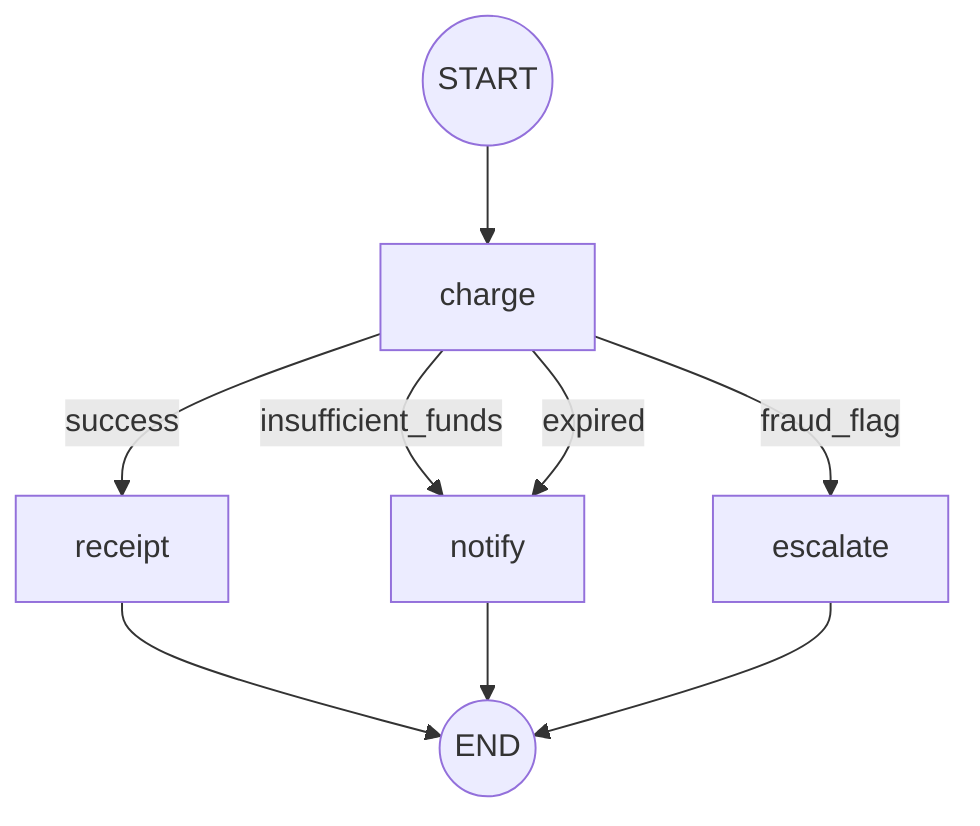
```mermaid
graph TD
    START((START))
    END((END))
    charge[charge]
    receipt[receipt]
    notify[notify]
    escalate[escalate]
    START --> charge
    charge -- success --> receipt
    charge -- insufficient_funds --> notify
    charge -- expired --> notify
    charge -- fraud_flag --> escalate
    receipt --> END
    notify --> END
    escalate --> END
```

### 2. Subscription Billing Logic
**File:** `subscription_billing.py`

**Purpose**: Manages recurring billing cycles, including grace periods and account locking.

**How it works**:
- Checks the current subscription status.
- Branches into renewal, sending reminders during grace periods, or locking the account if past due.

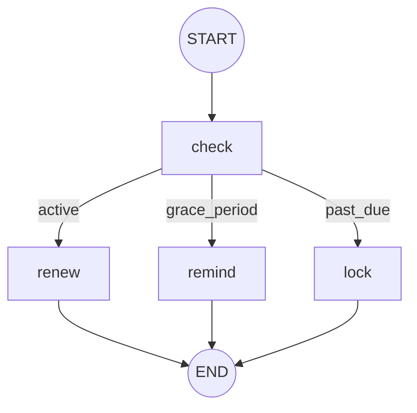
```mermaid
graph TD
    START((START))
    END((END))
    check[check]
    renew[renew]
    remind[remind]
    lock[lock]
    START --> check
    check -- active --> renew
    check -- grace_period --> remind
    check -- past_due --> lock
    renew --> END
    remind --> END
    lock --> END
```

### 3. Refund Approval Workflow
**File:** `refund_approval.py`

**Purpose**: Automates small refund approvals while flagging larger amounts for manual review.

**How it works**:
- Evaluates the refund amount.
- Auto-approves if under a threshold, otherwise assigns it to a manager.

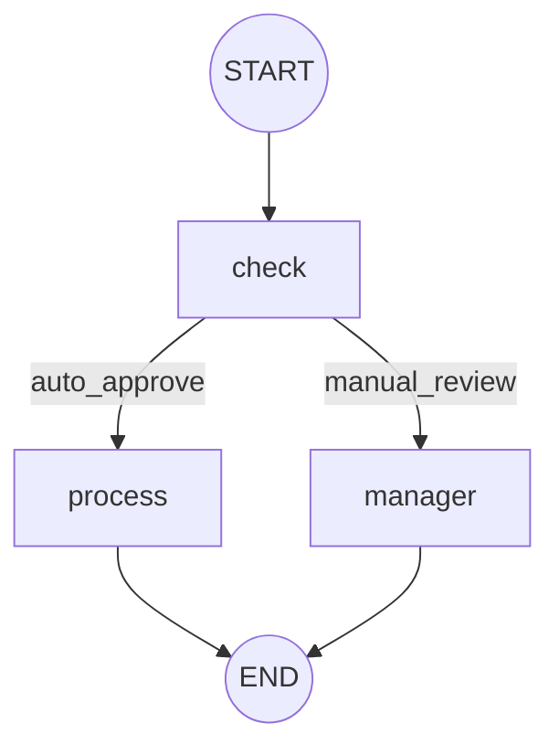
```mermaid
graph TD
    START((START))
    END((END))
    check[check]
    process[process]
    manager[manager]
    START --> check
    check -- auto_approve --> process
    check -- manual_review --> manager
    process --> END
    manager --> END
```

### 4. Fraud Detection Pipeline
**File:** `fraud_detection.py`

**Purpose**: Scores transaction risk to determine if it should be approved, blocked, or require MFA.

**How it works**:
- A risk scoring node evaluates the transaction.
- Branches to immediate approval, secondary verification (MFA), or immediate block.

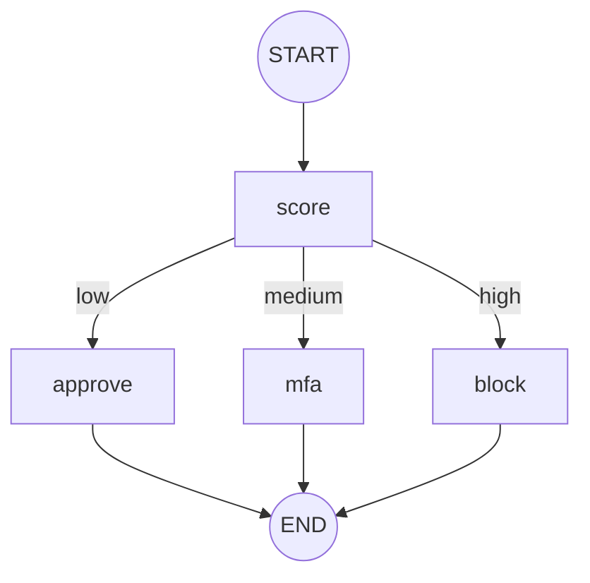
```mermaid
graph TD
    START((START))
    END((END))
    score[score]
    approve[approve]
    mfa[mfa]
    block[block]
    START --> score
    score -- low --> approve
    score -- medium --> mfa
    score -- high --> block
    approve --> END
    mfa --> END
    block --> END
```

### 5. Expense Reimbursement
**File:** `expense_reimbursement.py`

**Purpose**: Routes expense claims to the appropriate department for policy checks and approval.

**How it works**:
- Categorizes the expense (e.g., Travel, Hardware).
- Routes to specific check nodes based on the category.

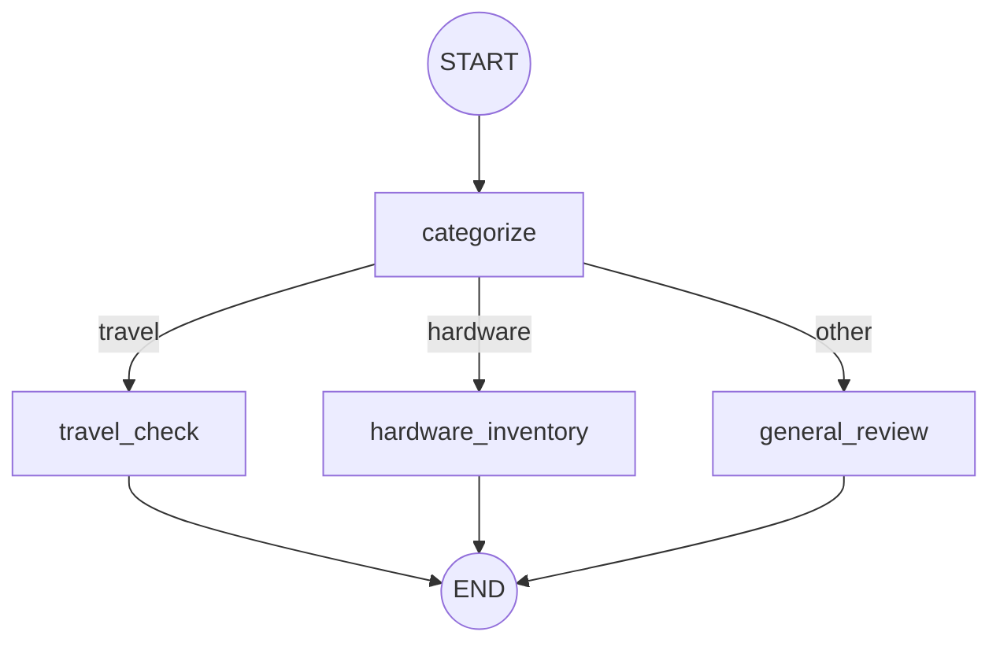
```mermaid
graph TD
    START((START))
    END((END))
    categorize[categorize]
    travel_check[travel_check]
    hardware_inventory[hardware_inventory]
    general_review[general_review]
    START --> categorize
    categorize -- travel --> travel_check
    categorize -- hardware --> hardware_inventory
    categorize -- other --> general_review
    travel_check --> END
    hardware_inventory --> END
    general_review --> END
```

---

## User Lifecycle & Security

### 6. Multi-Factor Authentication (MFA)
**File:** `mfa_flow.py`

**Purpose**: Allows users to choose their preferred MFA method (SMS or TOTP).

**How it works**:
- Retrieves user preference.
- Branches to the specific verification method chosen.

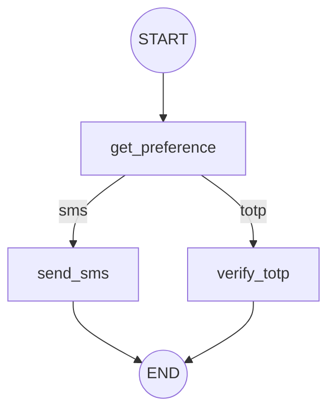
```mermaid
graph TD
    START((START))
    END((END))
    get_preference[get_preference]
    send_sms[send_sms]
    verify_totp[verify_totp]
    START --> get_preference
    get_preference -- sms --> send_sms
    get_preference -- totp --> verify_totp
    send_sms --> END
    verify_totp --> END
```

### 7. Identity Verification (KYC)
**File:** `kyc_verification.py`

**Purpose**: Handles automated document scanning and routes suspicious cases for manual review.

**How it works**:
- Scans the uploaded document.
- Branches based on quality and authenticity checks (clear, blurry, or suspicious).

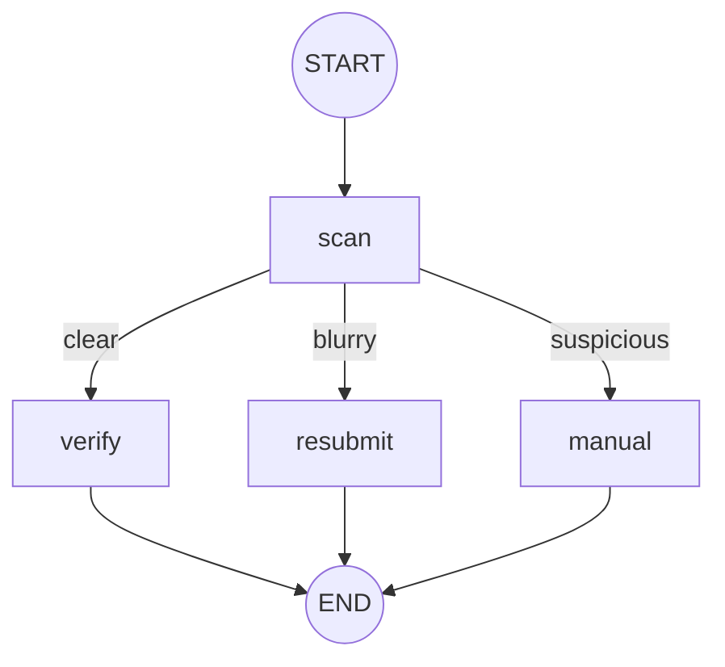
```mermaid
graph TD
    START((START))
    END((END))
    scan[scan]
    verify[verify]
    resubmit[resubmit]
    manual[manual]
    START --> scan
    scan -- clear --> verify
    scan -- blurry --> resubmit
    scan -- suspicious --> manual
    verify --> END
    resubmit --> END
    manual --> END
```

### 8. User Onboarding
**File:** `user_onboarding.py`

**Purpose**: Tailors the onboarding experience based on the user's role (Admin vs. Member).

**How it works**:
- Identifies the user type.
- Routes to team setup for admins or team joining for members.

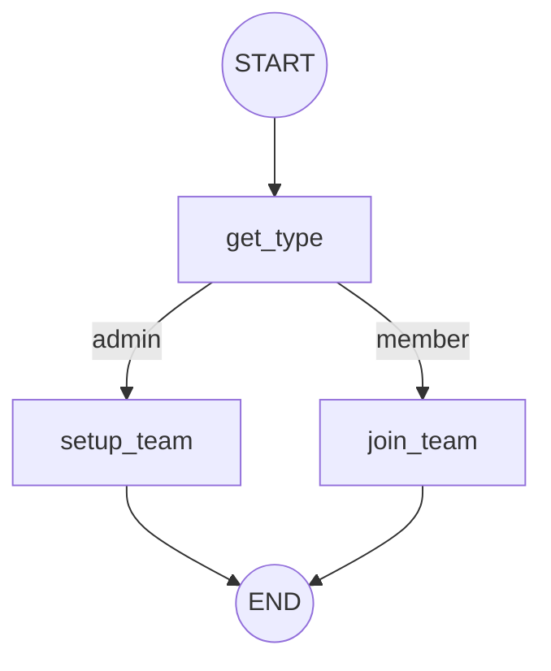
```mermaid
graph TD
    START((START))
    END((END))
    get_type[get_type]
    setup_team[setup_team]
    join_team[join_team]
    START --> get_type
    get_type -- admin --> setup_team
    get_type -- member --> join_team
    setup_team --> END
    join_team --> END
```

### 9. Password Reset Flow
**File:** `password_reset.py`

**Purpose**: Provides different reset paths depending on account security settings.

**How it works**:
- Checks if the user has security questions configured.
- Branches to either security questions or an email-based reset link.

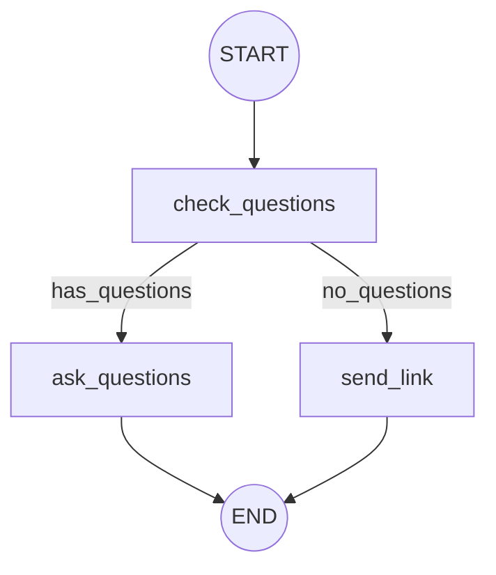
```mermaid
graph TD
    START((START))
    END((END))
    check_questions[check_questions]
    ask_questions[ask_questions]
    send_link[send_link]
    START --> check_questions
    check_questions -- has_questions --> ask_questions
    check_questions -- no_questions --> send_link
    ask_questions --> END
    send_link --> END
```

### 10. Account Suspension Recovery
**File:** `account_recovery.py`

**Purpose**: Logic for account recovery based on the reason for suspension.

**How it works**:
- Retrieves the suspension reason.
- Routes to an appeals process for TOS violations or a payment update for billing issues.

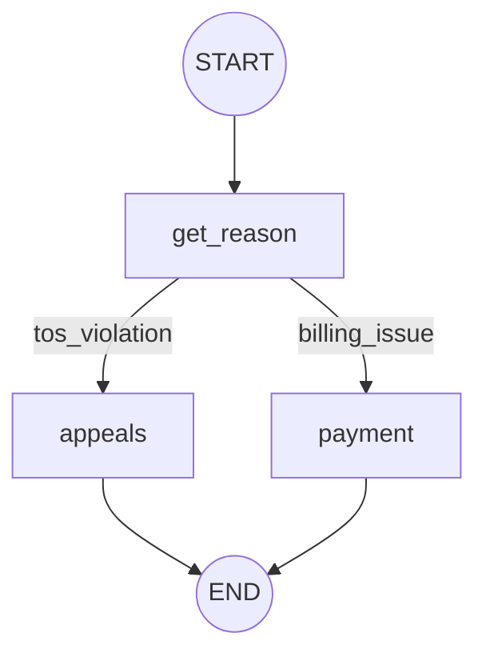
```mermaid
graph TD
    START((START))
    END((END))
    get_reason[get_reason]
    appeals[appeals]
    payment[payment]
    START --> get_reason
    get_reason -- tos_violation --> appeals
    get_reason -- billing_issue --> payment
    appeals --> END
    payment --> END
```

---

## Data & ETL Pipelines

### 11. File Import and Validation
**File:** `file_import.py`

**Purpose**: Routes file processing logic based on detected file types (CSV, JSON, XML).

**How it works**:
- Detects the file format.
- Branches to the appropriate parser node.

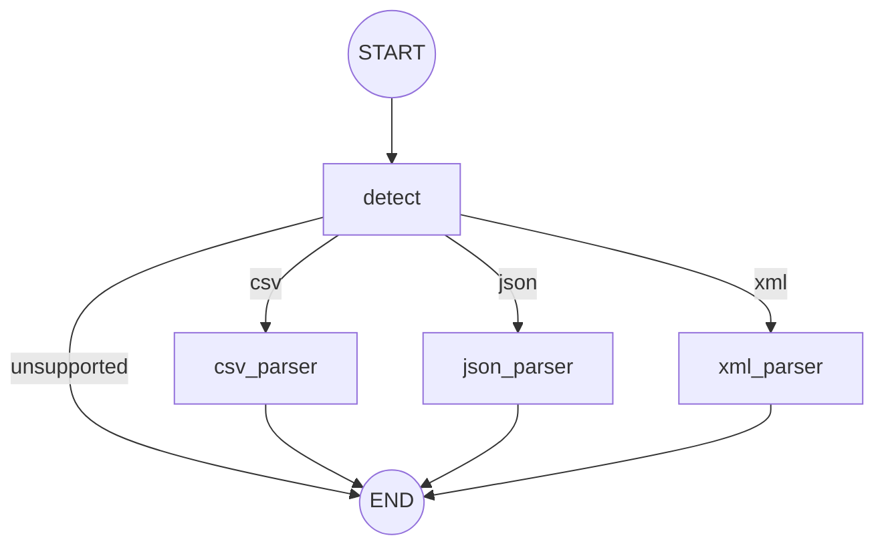
```mermaid
graph TD
    START((START))
    END((END))
    detect[detect]
    csv_parser[csv_parser]
    json_parser[json_parser]
    xml_parser[xml_parser]
    START --> detect
    detect -- csv --> csv_parser
    detect -- json --> json_parser
    detect -- xml --> xml_parser
    detect -- unsupported --> END
    csv_parser --> END
    json_parser --> END
    xml_parser --> END
```

### 12. Large-Scale Data Migration
**File:** `data_migration.py`

**Purpose**: Efficiently handles data migration by choosing between bulk inserts or record merging.

**How it works**:
- Checks if data already exists in the destination.
- Branches to merging for existing data or bulk insert for empty destinations.

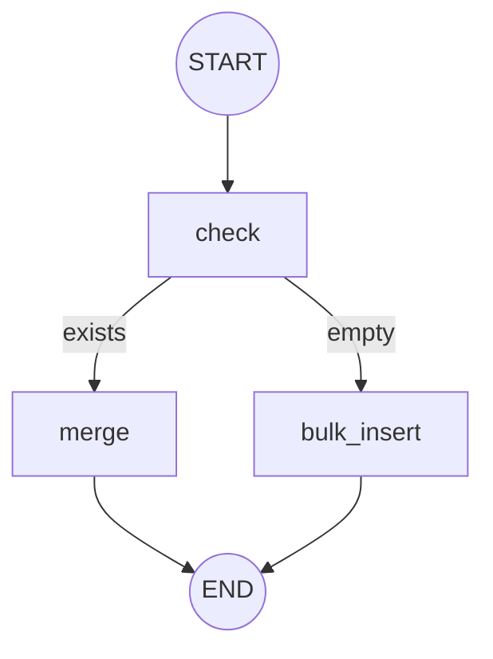
```mermaid
graph TD
    START((START))
    END((END))
    check[check]
    merge[merge]
    bulk_insert[bulk_insert]
    START --> check
    check -- exists --> merge
    check -- empty --> bulk_insert
    merge --> END
    bulk_insert --> END
```

### 13. Web Scraping with Proxy Rotation
**File:** `proxy_scraper.py`

**Purpose**: Implements a resilient web scraper that handles blocks and timeouts with proxy rotation.

**How it works**:
- Attempts to fetch a page.
- Branches to rotate proxy on blocks, retry on timeouts, or finish on success.

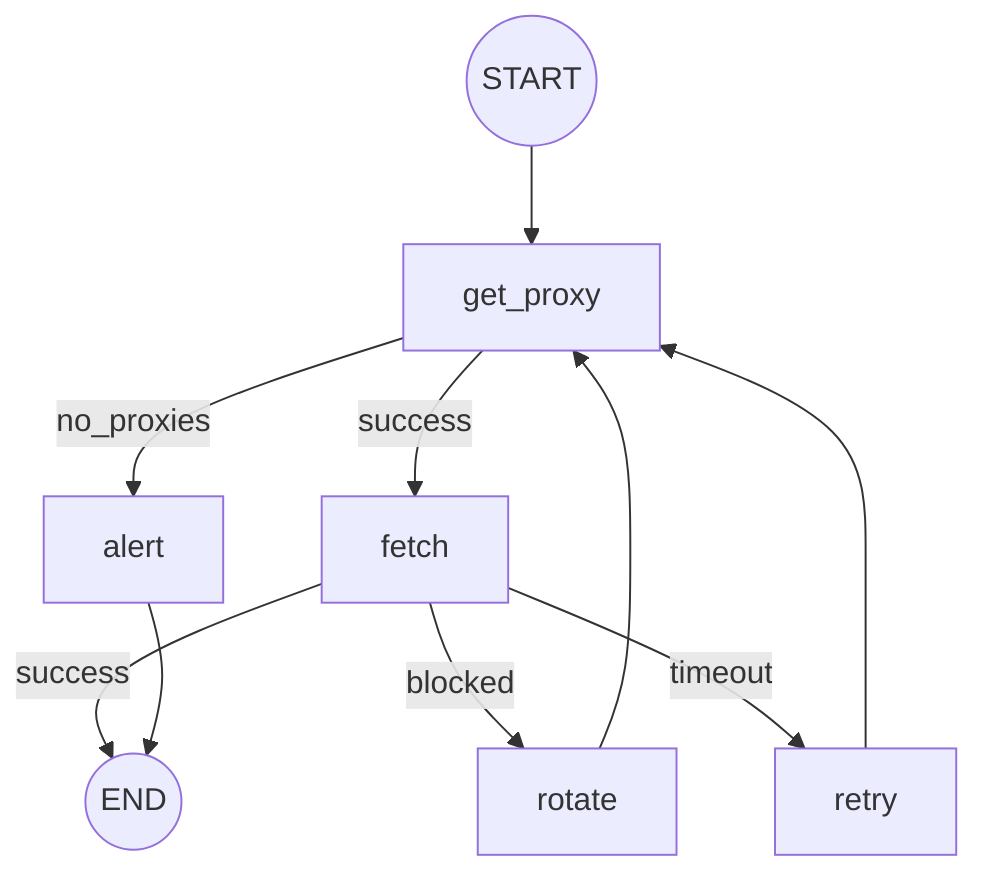
```mermaid
graph TD
    START((START))
    END((END))
    get_proxy[get_proxy]
    fetch[fetch]
    rotate[rotate]
    retry[retry]
    alert[alert]
    START --> get_proxy
    get_proxy -- success --> fetch
    get_proxy -- no_proxies --> alert
    fetch -- success --> END
    fetch -- blocked --> rotate
    fetch -- timeout --> retry
    rotate --> get_proxy
    retry --> get_proxy
    alert --> END
```

### 14. Database Backup & Verification
**File:** `backup_verification.py`

**Purpose**: Ensures database backups are valid before storage and alerts on corruption.

**How it works**:
- Performs the backup and then a verification check.
- Branches to S3 storage if valid or alerts a DBA if corrupt.

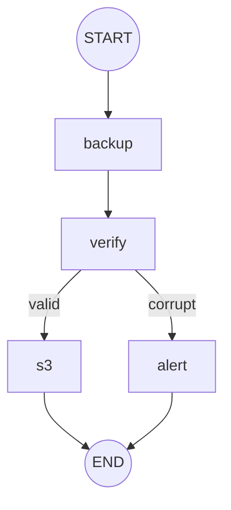
```mermaid
graph TD
    START((START))
    END((END))
    backup[backup]
    verify[verify]
    s3[s3]
    alert[alert]
    START --> backup
    backup --> verify
    verify -- valid --> s3
    verify -- corrupt --> alert
    s3 --> END
    alert --> END
```

### 15. API Data Synchronization
**File:** `api_sync.py`

**Purpose**: Optimizes API syncs by choosing between delta and full syncs.

**How it works**:
- Checks the timestamp of the last successful sync.
- Branches to delta sync if recent, otherwise performs a full sync.

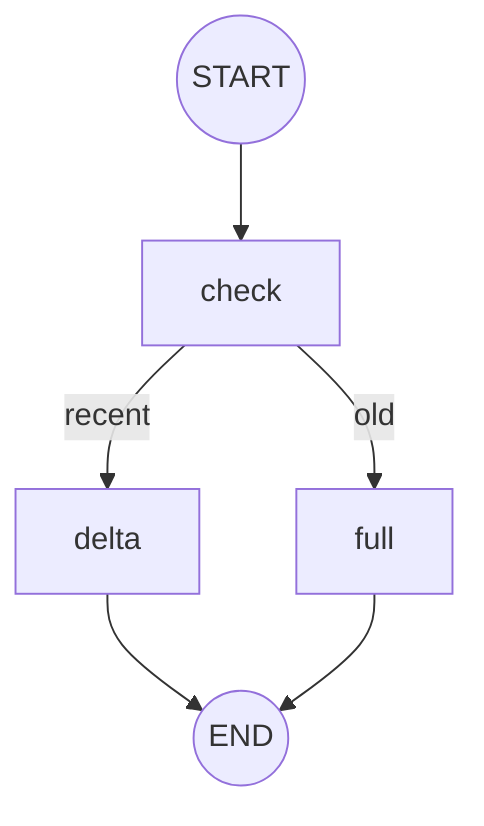
```mermaid
graph TD
    START((START))
    END((END))
    check[check]
    delta[delta]
    full[full]
    START --> check
    check -- recent --> delta
    check -- old --> full
    delta --> END
    full --> END
```

---

## Infrastructure & Operations

### 16. Cloud Resource Provisioning
**File:** `cloud_provisioning.py`

**Purpose**: Manages cloud instance creation with automated quota management.

**How it works**:
- Requests a new instance.
- Branches to configuration on success, quota increase request on limit hits, or cleanup on errors.

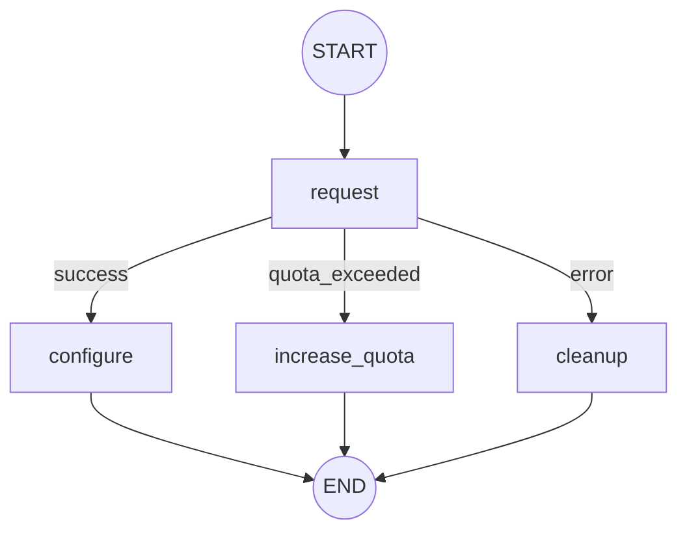
```mermaid
graph TD
    START((START))
    END((END))
    request[request]
    configure[configure]
    increase_quota[increase_quota]
    cleanup[cleanup]
    START --> request
    request -- success --> configure
    request -- quota_exceeded --> increase_quota
    request -- error --> cleanup
    configure --> END
    increase_quota --> END
    cleanup --> END
```

### 17. Health Check & Auto-Healing
**File:** `health_check.py`

**Purpose**: Monitors service health and performs corrective actions like restarts or replacements.

**How it works**:
- Executes a health check.
- Branches to logging (healthy), restarting (unresponsive), or replacing (critical failure).

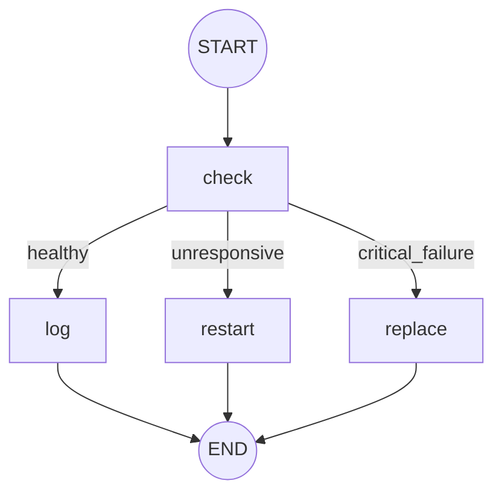
```mermaid
graph TD
    START((START))
    END((END))
    check[check]
    log[log]
    restart[restart]
    replace[replace]
    START --> check
    check -- healthy --> log
    check -- unresponsive --> restart
    check -- critical_failure --> replace
    log --> END
    restart --> END
    replace --> END
```

### 18. CI/CD Deployment Pipeline
**File:** `cicd_pipeline.py`

**Purpose**: Controls the deployment flow based on test results.

**How it works**:
- Runs the test suite.
- Branches to production deployment on success, or specific notification/rollback logic on failure.

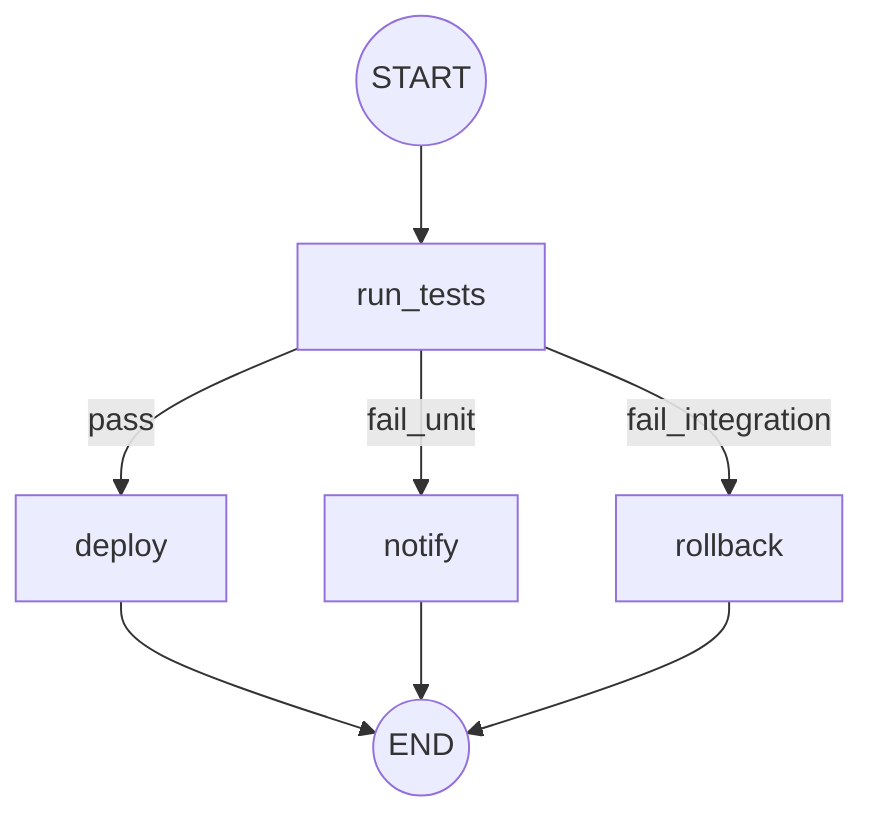
```mermaid
graph TD
    START((START))
    END((END))
    run_tests[run_tests]
    deploy[deploy]
    notify[notify]
    rollback[rollback]
    START --> run_tests
    run_tests -- pass --> deploy
    run_tests -- fail_unit --> notify
    run_tests -- fail_integration --> rollback
    deploy --> END
    notify --> END
    rollback --> END
```

### 19. IoT Device Firmware Update
**File:** `iot_firmware.py`

**Purpose**: Safety-first firmware updates based on device battery level.

**How it works**:
- Checks the battery status of the IoT device.
- Branches to update if sufficient, or waits until the device is charged.

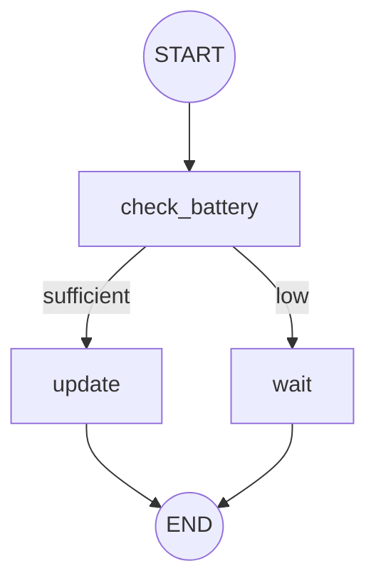
```mermaid
graph TD
    START((START))
    END((END))
    check_battery[check_battery]
    update[update]
    wait[wait]
    START --> check_battery
    check_battery -- sufficient --> update
    check_battery -- low --> wait
    update --> END
    wait --> END
```

### 20. SSL Certificate Renewal
**File:** `ssl_renewal.py`

**Purpose**: Handles SSL renewals via automated HTTP challenges or manual DNS challenges.

**How it works**:
- Checks for DNS access.
- Branches to HTTP challenge for automatic, or DNS challenge for manual.

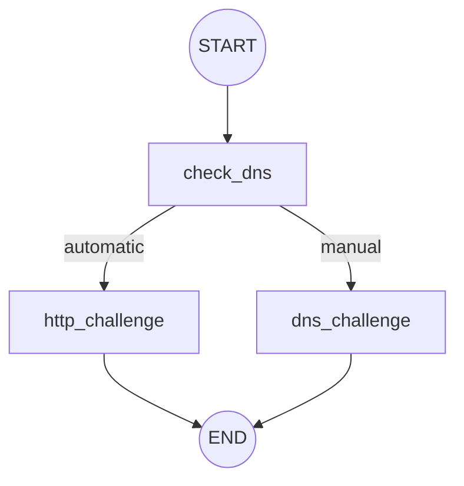
```mermaid
graph TD
    START((START))
    END((END))
    check_dns[check_dns]
    http_challenge[http_challenge]
    dns_challenge[dns_challenge]
    START --> check_dns
    check_dns -- automatic --> http_challenge
    check_dns -- manual --> dns_challenge
    http_challenge --> END
    dns_challenge --> END
```

---

## Content & AI Workflows

### 21. AI Content Moderation
**File:** `ai_moderation.py`

**Purpose**: AI-driven content moderation with a human-in-the-loop for borderline cases.

**How it works**:
- AI node scores the content.
- Branches to immediate publication, human review, or rejection.

```mermaid
graph TD
    START((START))
    END((END))
    ai_moderator[ai_moderator]
    publish[publish]
    human_review[human_review]
    notify[notify]
    START --> ai_moderator
    ai_moderator -- approved --> publish
    ai_moderator -- flagged --> human_review
    ai_moderator -- rejected --> notify
    publish --> END
    human_review --> END
    notify --> END
```

### 22. LLM-powered Data Extraction
**File:** `llm_extraction.py`

**Purpose**: Ensures high-quality LLM data extraction through iterative validation.

**How it works**:
- Validates the extracted data against a schema.
- Branches to saving on success, or refining the prompt and retrying on failure.

```mermaid
graph TD
    START((START))
    END((END))
    validate[validate]
    save[save]
    refine[refine]
    START --> validate
    validate -- valid --> save
    validate -- invalid --> refine
    refine --> validate
    save --> END
```

### 23. Video Transcoding & Quality Check
**File:** `video_transcoding.py`

**Purpose**: Filters and transcodes video files based on resolution.

**How it works**:
- Inspects the video resolution.
- Branches to transcoding for high-res videos or notifies the user for low-res ones.

```mermaid
graph TD
    START((START))
    END((END))
    inspect[inspect]
    transcode[transcode]
    notify_low_quality[notify_low_quality]
    START --> inspect
    inspect -- high_res --> transcode
    inspect -- low_res --> notify_low_quality
    transcode --> END
    notify_low_quality --> END
```

### 24. Automated Support Ticketing
**File:** `support_ticketing.py`

**Purpose**: Routes support tickets based on customer sentiment analysis.

**How it works**:
- Analyzes the sentiment of the ticket.
- Routes to escalation for angry customers, auto-reply for neutral, or review requests for happy ones.

```mermaid
graph TD
    START((START))
    END((END))
    analyze[analyze]
    escalate[escalate]
    auto_reply[auto_reply]
    request_review[request_review]
    START --> analyze
    analyze -- angry --> escalate
    analyze -- neutral --> auto_reply
    analyze -- happy --> request_review
    escalate --> END
    auto_reply --> END
    request_review --> END
```

### 25. Email Campaign Personalization
**File:** `email_campaign.py`

**Purpose**: Personalizes email campaigns based on user engagement levels.

**How it works**:
- Checks user engagement history.
- Routes to loyalty discounts, win-back offers, or welcome series.

```mermaid
graph TD
    START((START))
    END((END))
    check_engagement[check_engagement]
    loyalty[loyalty]
    winback[winback]
    welcome[welcome]
    START --> check_engagement
    check_engagement -- active --> loyalty
    check_engagement -- churning --> winback
    check_engagement -- new --> welcome
    loyalty --> END
    winback --> END
    welcome --> END
```
