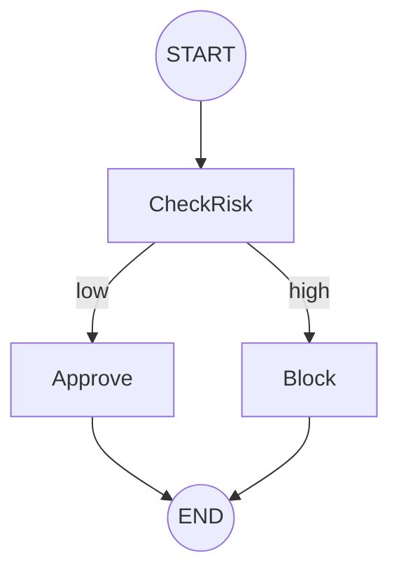

# 25 Use Cases for simple_state_flow with Conditional Edges

This document explores 25 real-world use cases for the `simple_state_flow` library, specifically highlighting how **conditional edges** facilitate complex branching logic in Python workflows.

---

## Financial & Transactional

### 1. Payment Processing Gateway
**Problem**: Processing a credit card payment requires handling multiple failure scenarios (insufficient funds, expired card, fraud flag).
- **Node**: `ChargeCardNode`
- **Result**: `"success"`, `"insufficient_funds"`, `"expired"`, `"fraud_flag"`
- **Conditional Edge**:
  - `"success"` -> `EmailReceiptNode`
  - `"insufficient_funds"` -> `NotifyUserNode`
  - `"expired"` -> `UpdateCardNode`
  - `"fraud_flag"` -> `EscalateToSecurityNode`

### 2. Subscription Billing Logic
**Problem**: Recurring billing needs to handle grace periods and eventual cancellations.
- **Node**: `CheckSubscriptionNode`
- **Result**: `"active"`, `"past_due"`, `"grace_period"`
- **Conditional Edge**:
  - `"active"` -> `RenewSubscriptionNode`
  - `"past_due"` -> `LockAccountNode`
  - `"grace_period"` -> `SendReminderNode`

### 3. Refund Approval Workflow
**Problem**: Refunds below $50 are auto-approved; others need manager review.
- **Node**: `CheckAmountNode`
- **Result**: `"auto_approve"`, `"manual_review"`
- **Conditional Edge**:
  - `"auto_approve"` -> `ProcessRefundNode`
  - `"manual_review"` -> `AssignToManagerNode`

### 4. Fraud Detection Pipeline
**Problem**: Transaction risk scoring determines immediate block or secondary verification.
- **Node**: `RiskScoreNode`
- **Result**: `"low"`, `"medium"`, `"high"`
- **Conditional Edge**:
  - `"low"` -> `ApproveTransactionNode`
  - `"medium"` -> `TriggerMFANode`
  - `"high"` -> `BlockTransactionNode`

### 5. Expense Reimbursement
**Problem**: Expense claims branch based on categories like travel or hardware.
- **Node**: `CategorizeExpenseNode`
- **Result**: `"travel"`, `"hardware"`, `"other"`
- **Conditional Edge**:
  - `"travel"` -> `TravelPolicyCheckNode`
  - `"hardware"` -> `InventoryUpdateNode`
  - `"other"` -> `GeneralApprovalNode`

---

## User Lifecycle & Security

### 6. Multi-Factor Authentication (MFA)
**Problem**: User must choose between SMS or App-based TOTP.
- **Node**: `GetPreferenceNode`
- **Result**: `"sms"`, `"totp"`
- **Conditional Edge**:
  - `"sms"` -> `SendSMSCodeNode`
  - `"totp"` -> `VerifyAppCodeNode`

### 7. Identity Verification (KYC)
**Problem**: Automated document check vs. manual document review.
- **Node**: `ScanDocumentNode`
- **Result**: `"clear"`, `"blurry"`, `"suspicious"`
- **Conditional Edge**:
  - `"clear"` -> `VerifyIdentityNode`
  - `"blurry"` -> `RequestResubmitNode`
  - `"suspicious"` -> `ManualReviewNode`

### 8. User Onboarding
**Problem**: Tailored onboarding based on user persona (Admin vs. Member).
- **Node**: `GetUserTypeNode`
- **Result**: `"admin"`, `"member"`
- **Conditional Edge**:
  - `"admin"` -> `SetupTeamNode`
  - `"member"` -> `JoinTeamNode`

### 9. Password Reset Flow
**Problem**: Different flows for users with and without security questions.
- **Node**: `CheckSecurityQuestionsNode`
- **Result**: `"has_questions"`, `"no_questions"`
- **Conditional Edge**:
  - `"has_questions"` -> `AskSecurityQuestionsNode`
  - `"no_questions"` -> `SendEmailLinkNode`

### 10. Account Suspension Recovery
**Problem**: Logic depends on why the account was suspended (TOS vs. Billing).
- **Node**: `GetSuspensionReasonNode`
- **Result**: `"tos_violation"`, `"billing_issue"`
- **Conditional Edge**:
  - `"tos_violation"` -> `AppealsProcessNode`
  - `"billing_issue"` -> `PaymentUpdateNode`

---

## Data & ETL Pipelines

### 11. File Import & Validation
**Problem**: Handling CSV, JSON, and XML imports in a single flow.
- **Node**: `DetectFileTypeNode`
- **Result**: `"csv"`, `"json"`, `"xml"`
- **Conditional Edge**:
  - `"csv"` -> `CSVParserNode`
  - `"json"` -> `JSONParserNode`
  - `"xml"` -> `XMLParserNode`

### 12. Large-Scale Data Migration
**Problem**: Logic branches if the destination database already contains records.
- **Node**: `CheckExistingDataNode`
- **Result**: `"exists"`, `"empty"`
- **Conditional Edge**:
  - `"exists"` -> `MergeRecordsNode`
  - `"empty"` -> `BulkInsertNode`

### 13. Web Scraping with Proxy Rotation
**Problem**: Retrying with a new proxy if the current one is blocked.
- **Node**: `FetchPageNode`
- **Result**: `"success"`, `"blocked"`, `"timeout"`
- **Conditional Edge**:
  - `"success"` -> `ParseDataNode`
  - `"blocked"` -> `RotateProxyNode`
  - `"timeout"` -> `RetryFetchNode`

### 14. Database Backup & Verification
**Problem**: If the backup verification fails, trigger an immediate alert.
- **Node**: `VerifyBackupNode`
- **Result**: `"valid"`, `"corrupt"`
- **Conditional Edge**:
  - `"valid"` -> `StoreInS3Node`
  - `"corrupt"` -> `AlertDBANode`

### 15. API Data Synchronization
**Problem**: Syncing delta vs. full sync based on last sync timestamp.
- **Node**: `CheckLastSyncNode`
- **Result**: `"recent"`, `"old"`
- **Conditional Edge**:
  - `"recent"` -> `DeltaSyncNode`
  - `"old"` -> `FullSyncNode`

---

## Infrastructure & Operations

### 16. Cloud Resource Provisioning
**Problem**: Handling quota limits when creating cloud instances.
- **Node**: `RequestInstanceNode`
- **Result**: `"success"`, `"quota_exceeded"`, `"error"`
- **Conditional Edge**:
  - `"success"` -> `ConfigureInstanceNode`
  - `"quota_exceeded"` -> `RequestQuotaIncreaseNode`
  - `"error"` -> `CleanupResourcesNode`

### 17. Health Check & Auto-Healing
**Problem**: Restarting a service vs. replacing the instance.
- **Node**: `HealthCheckNode`
- **Result**: `"healthy"`, `"unresponsive"`, `"critical_failure"`
- **Conditional Edge**:
  - `"healthy"` -> `LogStatusNode`
  - `"unresponsive"` -> `RestartServiceNode`
  - `"critical_failure"` -> `ReplaceInstanceNode`

### 18. CI/CD Deployment Pipeline
**Problem**: Rolling back or promoting based on test results.
- **Node**: `RunTestsNode`
- **Result**: `"pass"`, `"fail_unit"`, `"fail_integration"`
- **Conditional Edge**:
  - `"pass"` -> `DeployToProdNode`
  - `"fail_unit"` -> `NotifyDevNode`
  - `"fail_integration"` -> `RollbackStagingNode`

### 19. IoT Device Firmware Update
**Problem**: Updating based on battery level.
- **Node**: `CheckBatteryNode`
- **Result**: `"sufficient"`, `"low"`
- **Conditional Edge**:
  - `"sufficient"` -> `StartFirmwareUpdateNode`
  - `"low"` -> `WaitUntilChargedNode`

### 20. SSL Certificate Renewal
**Problem**: Automatic renewal vs. manual DNS challenge.
- **Node**: `CheckDnsAccessNode`
- **Result**: `"automatic"`, `"manual"`
- **Conditional Edge**:
  - `"automatic"` -> `HttpChallengeNode`
  - `"manual"` -> `DnsChallengeNode`

---

## Content & AI Workflows

### 21. AI Content Moderation
**Problem**: AI flags content for human review if it's borderline.
- **Node**: `AIModeratorNode`
- **Result**: `"approved"`, `"flagged"`, `"rejected"`
- **Conditional Edge**:
  - `"approved"` -> `PublishContentNode`
  - `"flagged"` -> `HumanReviewNode`
  - `"rejected"` -> `NotifyAuthorNode`

### 22. LLM-powered Data Extraction
**Problem**: Re-running LLM if extracted data fails schema validation.
- **Node**: `ValidateExtractionNode`
- **Result**: `"valid"`, `"invalid"`
- **Conditional Edge**:
  - `"valid"` -> `SaveToDBNode`
  - `"invalid"` -> `RefinePromptNode`

### 23. Video Transcoding & Quality Check
**Problem**: If resolution is too low, reject; otherwise, transcode.
- **Node**: `InspectVideoNode`
- **Result**: `"high_res"`, `"low_res"`
- **Conditional Edge**:
  - `"high_res"` -> `TranscodeNode`
  - `"low_res"` -> `NotifyUserLowQualityNode`

### 24. Automated Support Ticketing
**Problem**: Routing tickets based on sentiment analysis.
- **Node**: `SentimentAnalysisNode`
- **Result**: `"angry"`, `"neutral"`, `"happy"`
- **Conditional Edge**:
  - `"angry"` -> `EscalateToLeadNode`
  - `"neutral"` -> `AutoReplyNode`
  - `"happy"` -> `RequestReviewNode`

### 25. Email Campaign Personalization
**Problem**: Choosing template based on user activity level.
- **Node**: `CheckEngagementNode`
- **Result**: `"active"`, `"churning"`, `"new"`
- **Conditional Edge**:
  - `"active"` -> `LoyaltyDiscountNode`
  - `"churning"` -> `WinBackOfferNode`
  - `"new"` -> `WelcomeSeriesNode`

---

## Flow Visualization Example
Using `simple_state_flow.to_mermaid()`, a typical conditional flow looks like this:

